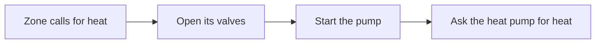

  

<h1 align="center">Hydronicus</h1>

  <strong>One plant. Many zones. No valve fights.</strong>

Hydronicus is a Home Assistant integration for heating and cooling with water: underfloor loops, cooled ceilings, and radiators, fed by a heat pump or a boiler.
You describe your system once: which valves serve which rooms, which pumps move the water, and what heats or cools it.
Hydronicus then opens the valves, runs the pumps, and asks the heat pump for heat or cooling, always in a safe order, and checks that each step really happened.

## Why use it

When every room's thermostat switches its own valve, nobody is in charge of the pumps and the heat pump.
Hydronicus coordinates the whole plant:

- Safe order: valves open first, then pumps start, then the heat pump is asked; everything stops in reverse.
- No dry pumps: a pump that needs an open loop never runs against closed valves.
- Heating and cooling: the same loops do both, never at the same time, with a pause between the two.
- Condensation guard: cooled floors and ceilings stay above the dew point of the room.
- Verified commands: a command counts only once Home Assistant shows its result; otherwise it is retried and reported.
- Built-in care: frost protection, and a weekly run of idle pumps and valves so they do not seize.
- Any hardware: works with any Home Assistant switch, valve, sensor, or thermostat, whichever integration provides it.
- Dry run first: a new Plant only shows what it would do, until you decide it may control your equipment.

## What you need

- Home Assistant with HACS. Hydronicus requires Home Assistant 2026.9.0 or newer.
- Your valves and pumps as `switch` or `valve` entities, such as relays.
- A temperature sensor for each zone, and for cooling, a humidity sensor and a water or surface temperature sensor.
- Optionally, a switch that asks your heat pump or boiler for heat, and a select that switches it between heating and cooling.

## Install

1. In HACS, open the menu and choose **Custom repositories**.
2. Add `https://github.com/brumi1024/ha-hydronicus` with the type **Integration**.
3. Install Hydronicus from HACS and restart Home Assistant.
4. Open **Settings > Devices & services**, choose **Add integration**, and search for **Hydronicus**.

## Get started

1. Try it without equipment.
   [Getting started](docs/getting-started.md) builds a small trial Plant on fake entities, so you can watch Hydronicus work in a few minutes.
2. Set up your own Plant.
   Guided setup asks for your plant form by form, or you can import a [plant file](docs/plant-file.md).
3. Watch, then go live.
   Check what Hydronicus proposes in Dry run, arm your outputs, and turn on **Control equipment**.

## How it fits together

| Word | What it means |
| --- | --- |
| Plant | Your whole heating and cooling system, set up once as one Hydronicus entry. |
| Source | The heat pump or boiler that heats or cools the water. Optional. |
| Pump | A circulator. Hydronicus switches it, or the source runs it by itself. |
| Zone | The space one thermostat controls, such as a room or a floor. It can follow Home Assistant areas. |
| Loop | One water path of a zone: the valves that open together, and the pump that moves the water. |
| Plant loop | A loop no zone owns, such as a towel dryer, or a hall that two zones share. |

When a zone calls for heat, Hydronicus works through the plant in order:

When the zone is warm, it stops in reverse: the heat pump first, then the pump after its overrun, then the valves.

## Safety

Hydronicus is software coordination, not a safety device.
Keep the physical protections of your plant, such as high-limit thermostats, pressure relief, and condensation switches, working without Home Assistant.
Read [safety limits](docs/safety.md) before you let Hydronicus control real equipment.

## Documentation

| Page | Read it to |
| --- | --- |
| [Getting started](docs/getting-started.md) | Try a trial Plant, then take your own plant live. |
| [Configuration](docs/configuration.md) | Find your way through setup, settings, zones, and areas. |
| [How it works](docs/how-it-works.md) | Understand what Hydronicus decides, and why. |
| [Entities and actions](docs/entities.md) | Build dashboards and automations. |
| [Plant file](docs/plant-file.md) | Describe a Plant in YAML. |
| [Safety limits](docs/safety.md) | Know what Hydronicus does and does not protect. |
| [Troubleshooting](docs/troubleshooting.md) | Find out why something does not run. |
| [Updating and removing](docs/updating-and-removing.md) | Update, roll back, or remove Hydronicus. |
| [Release notes](docs/releases) | See what changed in each version. |

Contributors start with [development](docs/development.md).

## Getting help

Open an issue with the [diagnostic bug report template](.github/ISSUE_TEMPLATE/diagnostic-bug-report.md).
Remove credentials, private addresses, and household details from anything you attach.
